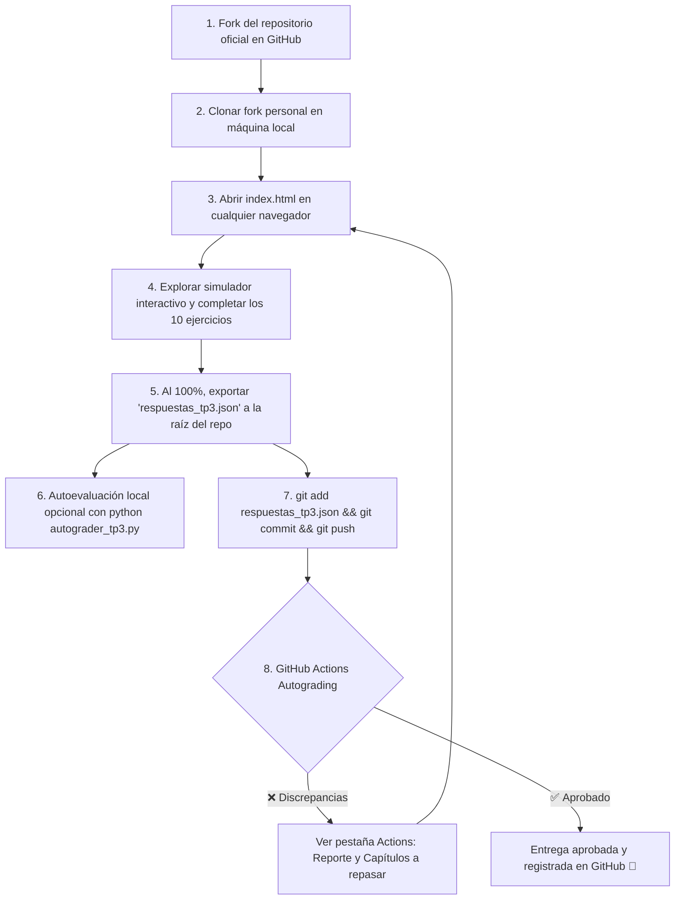

# 🎓 Trabajo Práctico N° 3: Algoritmos de Planificación de CPU
## Cátedra: Teoría de Sistemas Operativos (TSO) — Ciclo Lectivo 2026
### Universidad Nacional de Jujuy (UNJu) — Facultad de Ingeniería


---

## 🏛️ Información Institucional y Equipo Docente

- **Institución:** Universidad Nacional de Jujuy (UNJu) — Facultad de Ingeniería (FI).
- **Carreras:** Ingeniería Informática / Licenciatura en Sistemas.
- **Asignatura:** Teoría de Sistemas Operativos (TSO).
- **Ciclo Lectivo:** 2026.
- **Profesora Titular / Responsable de Cátedra:** Ing. María Fernanda Vázquez.
- **Jefe de Trabajos Prácticos (JTP):** Ing. Fabio D. Argañaraz.
- **Modalidad:** Estrictamente **individual**, autoevaluativo con exportación a JSON estructurado y entrega mediante **Git / GitHub Classroom**.
- **Organización Oficial en GitHub:** [https://github.com/UNJU-Teoria-de-Sistemas-Operativos](https://github.com/UNJU-Teoria-de-Sistemas-Operativos)

---

## 🎯 Objetivos Pedagógicos

Al finalizar este Trabajo Práctico, el estudiante será capaz de:

1. **Diferenciar Mecanismos de Políticas:** Distinguir con precisión las rutinas de bajo nivel del kernel (*Context Switch*, manipulación de punteros en colas) de los criterios de decisión de alto nivel (*quantum sizing*, priorización de interactivos).
2. **Dominar los 6 Algoritmos Clásicos Oficiales:** Analizar, trazar y comparar el comportamiento determinista de:
   - **FCFS / FIFO** (Primero en llegar, primero en ser servido; Efecto Convoy).
   - **SJN / SJF** (Shortest Job Next - No Apropiativo).
   - **SRT / SRTF** (Shortest Remaining Time - Apropiativo por menor tiempo remanente).
   - **Round Robin (RR)** (Reparto equitativo con quantum $q=2$, reencolado circular y desempate oficial).
   - **Prioridad Apropiativa** (Convención de cátedra: **mayor valor numérico = mayor prioridad**; ej. $3 > 2 > 1 > 0$).
   - **HRN** (Highest Response Ratio Next: prioridad dinámica $P = \frac{t+w}{t}$ para prevenir inanición).
3. **Calcular y Contrastar Métricas de Rendimiento:** Determinar tiempo de retorno ($T = t_f - t_i$), tiempo de espera ($E = T - t$), índice de servicio ($I_R = t/T$), e índice de penalización ($I_P = T/t$) considerando concurrencia entre ráfagas de CPU y operaciones de E/S.
4. **Comprender la Planificación Multiprocesador:** Identificar los desafíos de contención de memoria/bus, afinidad a procesador (*Processor Affinity*) y balanceo de carga (*Push/Pull Migration*).
5. **Utilizar Flujos de Integración Continua (CI):** Gestionar versionado con Git, resolver ejercicios mediante una aplicación web interactiva y autoevaluarse de forma automática con GitHub Actions.

---

## 📚 Mapeo Bibliográfico Obligatorio por Capítulo

Cada ejercicio del práctico está directamente vinculado con los libros oficiales provistos en el Aula Virtual y las presentaciones de cátedra:

| Ejercicio | Tema Principal | Bibliografía Oficial |
| :---: | :--- | :--- |
| **Ej 1** | Mecanismos vs. Políticas y Métricas ($T, E, I_R, I_P$) | • **Diapositivas Cátedra:** Clase 4, Diap. 5, 6, 10.<br>• **Silberschatz (7ma Ed.):** Cap. 5.1–5.2 (pp. 153–158).<br>• **Stallings (5ta Ed.):** Cap. 9.1 (pp. 385–393). |
| **Ej 2** | FCFS y Efecto Convoy | • **Diapositivas Cátedra:** Clase 4, Diap. 11, 14, 15.<br>• **Silberschatz:** Cap. 5.3.1 (pp. 158–160).<br>• **Carretero:** Cap. 3.4.1 (pp. 92–94). |
| **Ej 3** | SJN / SJF (No Apropiativo) | • **Diapositivas Cátedra:** Clase 4, Diap. 11, 12.<br>• **Silberschatz:** Cap. 5.3.2 (pp. 160–162).<br>• **Stallings:** Cap. 9.2 (pp. 396–399). |
| **Ej 4** | SRT (Apropiativo por Ráfaga Remanente) | • **Diapositivas Cátedra:** Clase 4, Diap. 11.<br>• **Silberschatz:** Cap. 5.3.2 (pp. 161–162).<br>• **Carretero:** Cap. 3.4.3 (pp. 96–98). |
| **Ej 5** | Round Robin ($q=2$): Quantum y Desempates | • **Diapositivas Cátedra:** Clase 4, Diap. 11, 12.<br>• **Silberschatz:** Cap. 5.3.4 (pp. 164–167).<br>• **Stallings:** Cap. 9.2 (pp. 393–396). |
| **Ej 6** | Prioridad Apropiativa e Inanición (Aging) | • **Diapositivas Cátedra:** Clase 4, Diap. 11, 12.<br>• **Silberschatz:** Cap. 5.3.3 (pp. 162–164).<br>• **Carretero:** Cap. 3.4.4 (pp. 98–101). |
| **Ej 7** | HRN (Highest Response Ratio Next) | • **Diapositivas Cátedra:** Clase 4, Diap. 11.<br>• **Stallings:** Cap. 9.2 (pp. 402–404).<br>• **Carretero:** Cap. 3.4.5 (pp. 101–103). |
| **Ej 8** | Matriz Multicriterio Comparativa | • **Resoluciones Cátedra:** FCFS, SJN, SRT, RR, Prioridad, HRN.<br>• **Silberschatz:** Cap. 5.4 (pp. 167–173). |
| **Ej 9** | Planificación en Sistemas Multiprocesador | • **Diapositivas Cátedra:** Clase 4, Diap. 17.<br>• **Silberschatz:** Cap. 5.5 (pp. 167–170).<br>• **Stallings:** Cap. 10.1 (pp. 427–436). |
| **Ej 10** | Evaluación y Selección de Políticas en el SO | • **Diapositivas Cátedra:** Clase 4, Diap. 18, 19.<br>• **Silberschatz:** Cap. 5.6 (pp. 170–175).<br>• **Tanenbaum (3ra Ed.):** Cap. 2.4.5 (pp. 154–158). |

---

## 🏗️ Estructura del Repositorio

```text
TP3/
├── .github/
│   └── workflows/
│       └── classroom.yml      # Workflow de GitHub Actions (Autograding CI)
├── index.html              # Aplicación web con Kernel Cockpit, Gantt y 10 ejercicios
├── pizarra_gantt.html      # Pizarra Digital Interactiva (Gantt Studio para maquetar soluciones)
├── styles.css              # Sistema visual Glassmorphism, temas Dark/Light y Gantt Grid
├── app.js                  # Motor de simulación, Gantt interactivo, ApexCharts y exportador
├── rubric_tp3.json         # Rúbrica pública protegida con hashes SHA-256 salteados
├── autograder_tp3.py       # Script autoevaluador en Python 3 para consola y GitHub Actions
├── README.md               # Guía del estudiante y documentación oficial
└── .gitignore              # Excluye rubric_master, temporales y caches de Python
```

---

## 🚀 Flujo de Trabajo del Estudiante (Paso a Paso)



### 1. Fork y Clonado
1. Ingresa a la organización oficial de la cátedra: [https://github.com/UNJU-Teoria-de-Sistemas-Operativos/TP3](https://github.com/UNJU-Teoria-de-Sistemas-Operativos/TP3).
2. Pulsa en **Fork** (arriba a la derecha) para crear una copia en tu cuenta personal.
3. Clona tu repositorio en tu máquina:
   ```bash
   git clone https://github.com/TU_USUARIO/TP3.git
   cd TP3
   ```

### 2. Resolución Interactiva
1. Haz doble clic sobre `index.html` para abrirlo en tu navegador favorito.
2. Ingresa tu Nombre, DNI y Usuario de GitHub en el encabezado.
3. Utiliza el **Kernel Cockpit** para reproducir tick a tick los 6 algoritmos, observar las transiciones entre la Cola de Listos, la CPU y la Bahía de E/S, y analizar los gráficos en el dashboard.
4. Resuelve los 10 ejercicios (el avance se autoguarda en `localStorage`).

### 3. Exportación y Entrega
1. Al alcanzar el **100% de progreso**, se habilitará el botón **"💾 Exportar Respuestas (.json)"**.
2. Descarga el archivo `respuestas_tp3.json` y colócalo en la **raíz de tu repositorio clonado**.
3. *(Opcional pero recomendado)* Si tienes Python 3 instalado, ejecuta el autoevaluador localmente:
   ```bash
   python autograder_tp3.py respuestas_tp3.json
   ```
4. Envía tu entrega a GitHub:
   ```bash
   git add respuestas_tp3.json
   git commit -m "Entrega TP3 - [Tu Nombre y Apellido]"
   git push origin main
   ```

### 4. Verificación de la Calificación en GitHub Actions
Inmediatamente tras el `push`, GitHub ejecutará el autograding:
- **Badge Verde (`✅ Check`)**: Has obtenido una calificación aprobatoria (≥ 4.0 / 10).
- **Badge Rojo (`❌ Cruz`)**: El autoevaluador detectó discrepancias. Haz clic en la cruz o ve a la pestaña **Actions** para consultar la tabla de desglose ejercicio por ejercicio y los capítulos que debes repasar.

---

## ⚖️ Criterios de Aprobación

- **Puntaje Máximo:** 100 puntos (Escala 0 a 10).
- **Nota Mínima de Aprobación:** 4.0 / 10 (40 puntos).
- **Rúbrica Protegida:** La evaluación se realiza mediante comparación criptográfica de hashes SHA-256 salteados (`rubric_tp3.json`), garantizando una autocorrección local objetiva sin exponer las respuestas directas.
# TP3 - Entrega
